# CoGWXP-OS9 Architecture Overview

## Executive Summary

CoGWXP-OS9 is a cognitive operating system that integrates four major computing paradigms into a unified AGI platform:

1. **Windows XP NT Kernel** - Provides robust microkernel architecture with process/memory management
2. **OpenCog Framework** - Delivers hypergraph-based knowledge representation and probabilistic reasoning
3. **Plan 9 from Bell Labs** - Contributes 9P protocol for distributed file systems
4. **Inferno-OS** - Provides Dis virtual machine and Limbo programming language

This document provides a comprehensive architectural analysis with formal diagrams showing component interactions, data flows, and integration boundaries.

## System Architecture

### High-Level Architecture

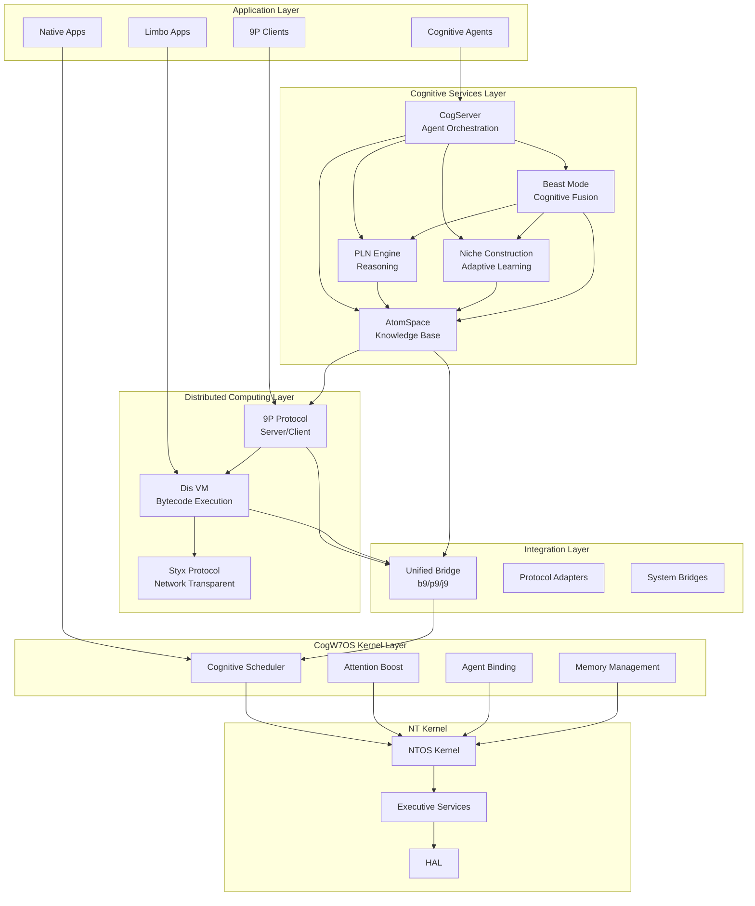

### Layered Architecture View

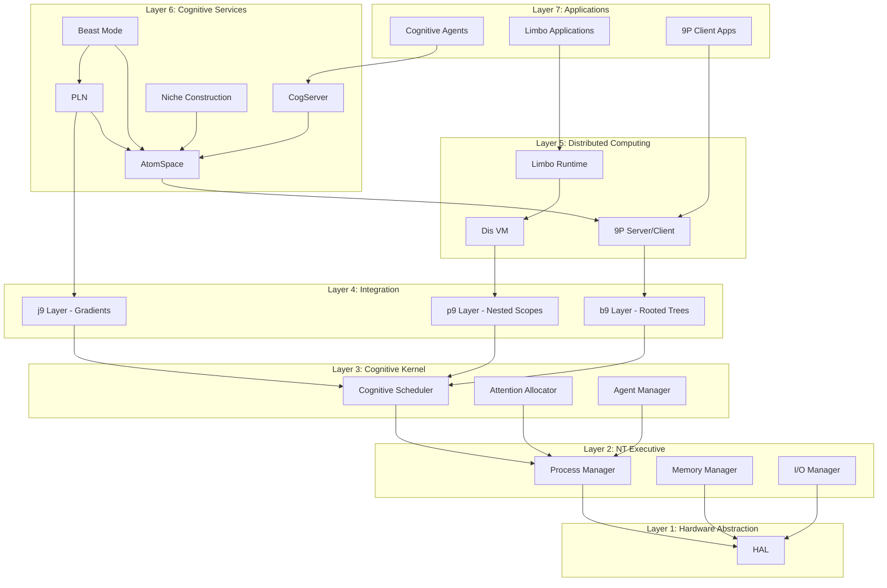

## Component Architecture

### OpenCog Cognitive Architecture

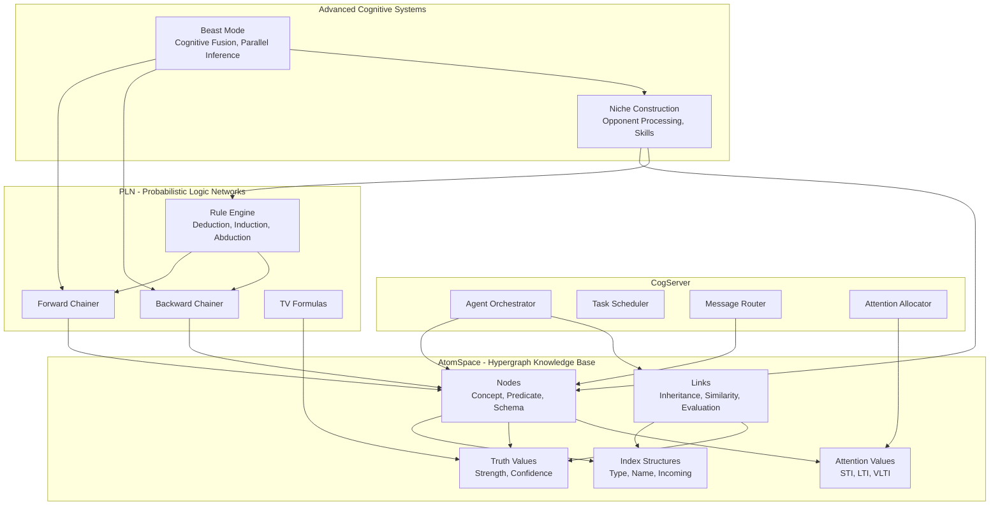

### Plan 9 / Inferno Integration

```mermaid
graph LR
    subgraph "9P Protocol Layer"
        P9_SERVER[9P Server]
        P9_CLIENT[9P Client]
        P9_MSGS[Message Handlers<br/>Tversion, Tattach, Twalk, Topen, Tread, Twrite]
    end
    
    subgraph "Namespace Layer"
        NS_ATOMS[/atoms/ filesystem]
        NS_AGENTS[/agents/ filesystem]
        NS_TASKS[/tasks/ filesystem]
        NS_DIS[/dis/ filesystem]
        NS_B9[/b9/ filesystem]
        NS_P9[/p9/ filesystem]
        NS_J9[/j9/ filesystem]
    end
    
    subgraph "Dis Virtual Machine"
        DIS_LOADER[Module Loader]
        DIS_EXEC[Bytecode Executor]
        DIS_GC[Garbage Collector]
        DIS_CHAN[Channel Manager]
    end
    
    subgraph "Limbo Compiler"
        LIMBO_LEX[Lexer]
        LIMBO_PARSE[Parser]
        LIMBO_GEN[Code Generator]
    end
    
    P9_SERVER --> NS_ATOMS
    P9_SERVER --> NS_AGENTS
    P9_SERVER --> NS_TASKS
    P9_SERVER --> NS_DIS
    P9_SERVER --> NS_B9
    P9_SERVER --> NS_P9
    P9_SERVER --> NS_J9
    
    P9_MSGS --> P9_SERVER
    P9_CLIENT --> P9_MSGS
    
    NS_DIS --> DIS_LOADER
    DIS_LOADER --> DIS_EXEC
    DIS_EXEC --> DIS_GC
    DIS_EXEC --> DIS_CHAN
    
    LIMBO_LEX --> LIMBO_PARSE
    LIMBO_PARSE --> LIMBO_GEN
    LIMBO_GEN --> DIS_LOADER
```

### b9/p9/j9 Integration Model

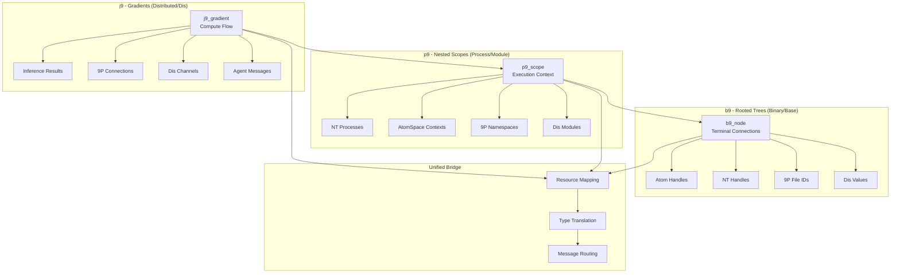

## Data Flow Architecture

### Knowledge Flow

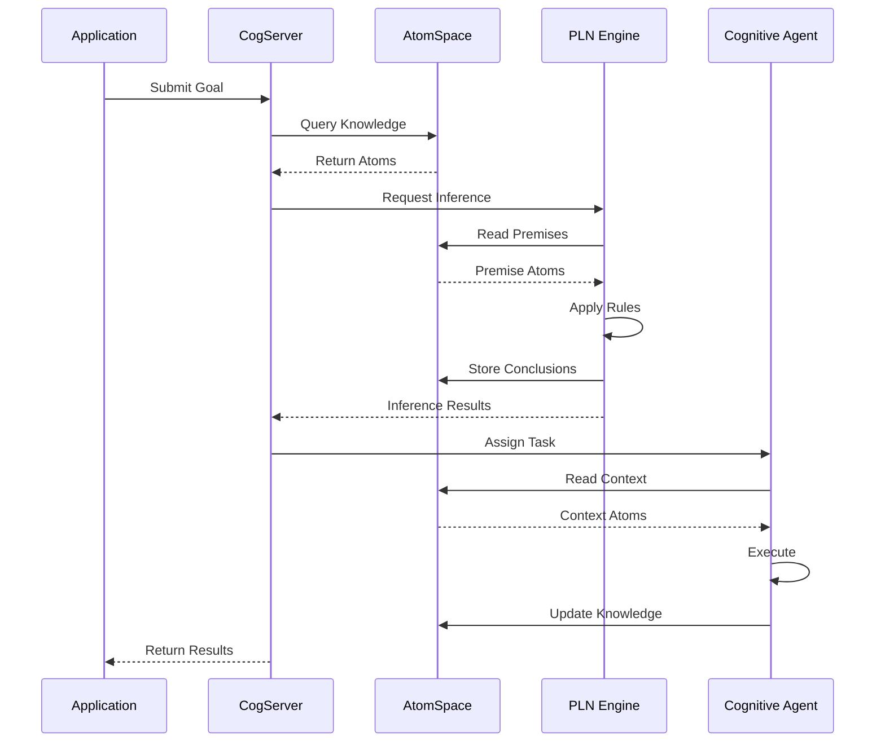

### Distributed Inference Flow

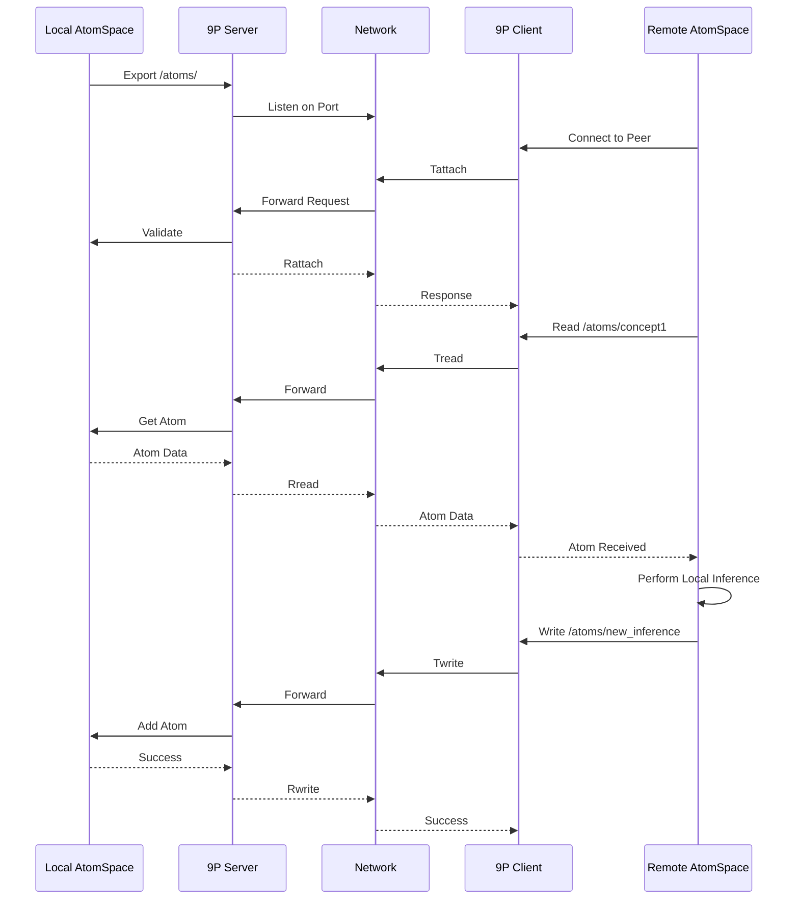

### Niche Construction Flow

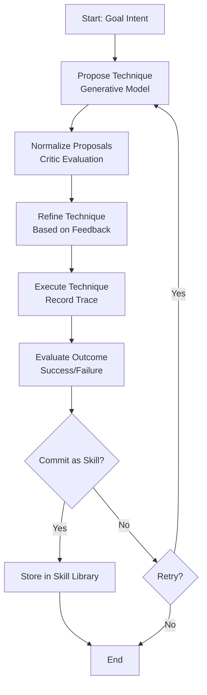

### Beast Mode Fusion Flow

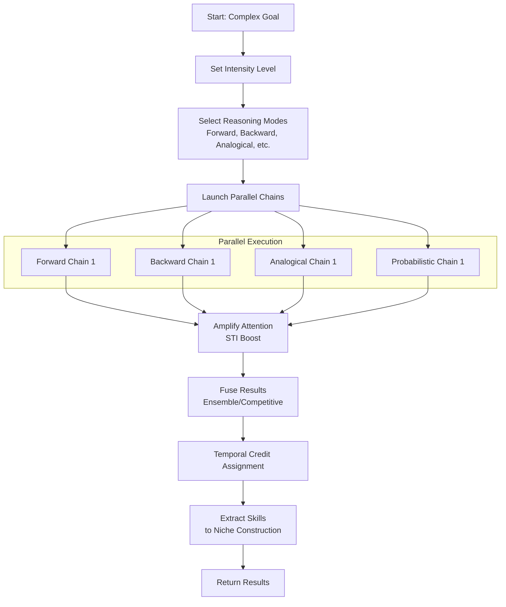

## Integration Boundaries

### System Integration Points

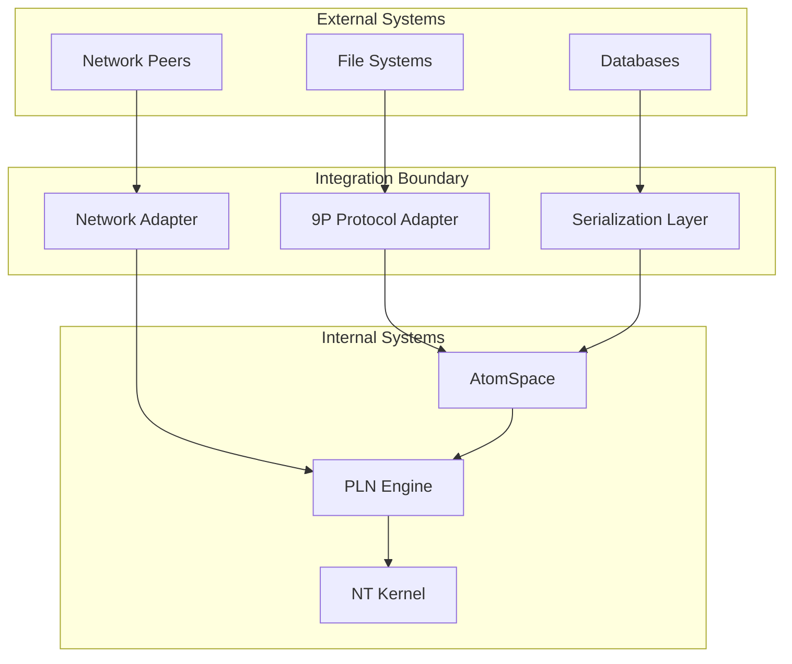

### 9P File System Layout

```mermaid
graph TD
    ROOT[/]
    
    ATOMS[/atoms/]
    ATOMS_TYPE[/atoms/by-type/]
    ATOMS_HANDLE[/atoms/by-handle/]
    ATOMS_CTL[/atoms/ctl]
    
    AGENTS[/agents/]
    AGENT1[/agents/agent_001/]
    AGENT_CTL[/agents/agent_001/ctl]
    AGENT_STATUS[/agents/agent_001/status]
    AGENT_INBOX[/agents/agent_001/inbox]
    AGENT_OUTBOX[/agents/agent_001/outbox]
    
    TASKS[/tasks/]
    TASK1[/tasks/task_001/]
    TASK_CTL[/tasks/task_001/ctl]
    TASK_STATUS[/tasks/task_001/status]
    
    DIS[/dis/]
    DIS_MOD[/dis/modules/]
    DIS_THREAD[/dis/threads/]
    DIS_CHAN[/dis/channels/]
    
    B9[/b9/]
    P9[/p9/]
    J9[/j9/]
    
    CTL[/ctl]
    STATS[/stats]
    
    ROOT --> ATOMS
    ROOT --> AGENTS
    ROOT --> TASKS
    ROOT --> DIS
    ROOT --> B9
    ROOT --> P9
    ROOT --> J9
    ROOT --> CTL
    ROOT --> STATS
    
    ATOMS --> ATOMS_TYPE
    ATOMS --> ATOMS_HANDLE
    ATOMS --> ATOMS_CTL
    
    AGENTS --> AGENT1
    AGENT1 --> AGENT_CTL
    AGENT1 --> AGENT_STATUS
    AGENT1 --> AGENT_INBOX
    AGENT1 --> AGENT_OUTBOX
    
    TASKS --> TASK1
    TASK1 --> TASK_CTL
    TASK1 --> TASK_STATUS
    
    DIS --> DIS_MOD
    DIS --> DIS_THREAD
    DIS --> DIS_CHAN
```

## Technology Stack Summary

| Layer | Component | Technology | Purpose |
|-------|-----------|------------|---------|
| Application | Cognitive Agents | C/Limbo | AGI agents and tasks |
| Cognitive Services | CogServer | C, OpenCog | Agent orchestration |
| Cognitive Services | AtomSpace | C, OpenCog | Knowledge representation |
| Cognitive Services | PLN | C, OpenCog | Probabilistic reasoning |
| Cognitive Services | Niche Construction | C | Adaptive learning |
| Cognitive Services | Beast Mode | C | Cognitive fusion |
| Distributed Computing | 9P Protocol | C, Plan 9 | Resource access protocol |
| Distributed Computing | Dis VM | C, Inferno | Virtual machine |
| Distributed Computing | Limbo | Limbo | Programming language |
| Integration | Unified Bridge | C | b9/p9/j9 integration |
| Cognitive Kernel | CogW7OS | C | Cognitive extensions |
| NT Kernel | NTOS | C | Microkernel |
| HAL | Hardware Abstraction | C | Hardware interface |

## Key Architectural Patterns

### 1. Hypergraph Knowledge Representation
- **Pattern**: All knowledge represented as atoms in a hypergraph
- **Implementation**: AtomSpace with nodes and links
- **Benefits**: Flexible, uniform representation; supports pattern matching and inference

### 2. Distributed Resource Access via 9P
- **Pattern**: Everything is a file, accessible via 9P protocol
- **Implementation**: 9P server exports AtomSpace, agents, tasks as file system
- **Benefits**: Network transparency; uniform access model; language-independent

### 3. Attention Allocation Economics
- **Pattern**: Short-Term Importance (STI) drives cognitive resource allocation
- **Implementation**: Attention values on atoms; attention bank; cognitive scheduler
- **Benefits**: Efficient resource use; emergent focus; scalable

### 4. Opponent Processing for Learning
- **Pattern**: Propose → Normalize → Refine → Commit cycles
- **Implementation**: Niche construction engine with generative and critic models
- **Benefits**: Adaptive learning; skill development; environment shaping

### 5. Multi-Modal Cognitive Fusion
- **Pattern**: Parallel reasoning strategies combined via fusion
- **Implementation**: Beast mode reactor with intensity levels and fusion strategies
- **Benefits**: Robust reasoning; multi-perspective analysis; emergent insights

### 6. Three-Layer Integration (b9/p9/j9)
- **Pattern**: Rooted trees (b9), nested scopes (p9), gradients (j9)
- **Implementation**: Unified bridge mapping across layers
- **Benefits**: Clean abstraction; unified model; composability

## Security Model

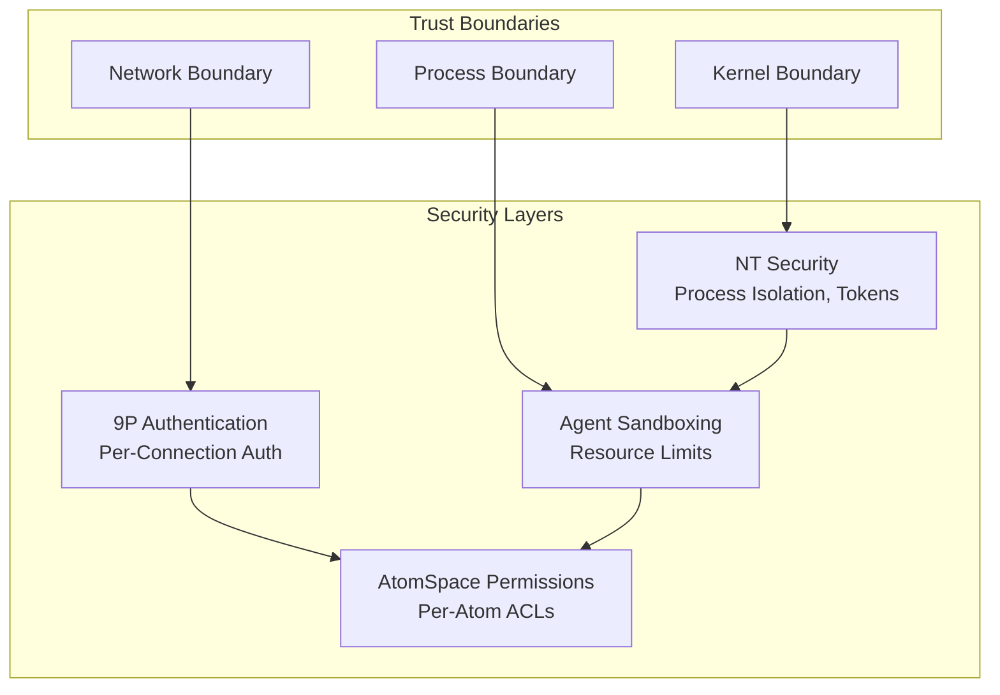

## Performance Characteristics

### AtomSpace Performance
- **Lookup**: O(1) by handle using hash table
- **Type Query**: O(n) where n = atoms of that type
- **Pattern Matching**: O(n*m) where n = candidate atoms, m = pattern complexity
- **Memory**: ~100-200 bytes per atom (varies by type and outgoing set size)

### PLN Inference Performance
- **Forward Chaining**: Exponential in depth without pruning; configurable limits
- **Backward Chaining**: Polynomial in goal complexity; early termination
- **Rule Application**: O(1) truth value computation
- **Caching**: Significant speedup for repeated inferences

### 9P Protocol Performance
- **Latency**: Network RTT + processing time
- **Throughput**: Limited by network bandwidth and message serialization
- **Concurrency**: Multiple concurrent connections supported
- **Optimization**: Connection pooling, request pipelining

### Dis VM Performance
- **Module Loading**: O(n) where n = module size
- **Bytecode Execution**: Interpreted; ~10-50x slower than native code
- **Garbage Collection**: Mark-and-sweep; pause times ~1-10ms
- **Optimization**: JIT compilation for hot paths (future enhancement)

## Deployment Architecture

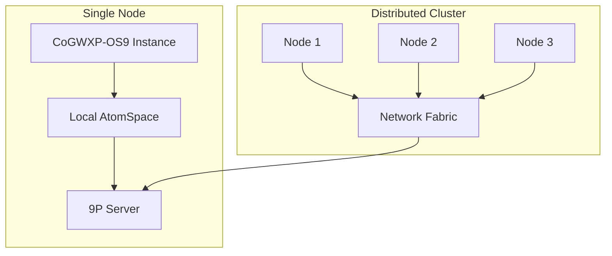

## Future Extensions

1. **Hyperon Integration**: MeTTa language support for advanced meta-learning
2. **GPU Acceleration**: CUDA/OpenCL for parallel PLN inference
3. **Persistent AtomSpace**: RocksDB/PostgreSQL backend for durability
4. **WebAssembly Support**: WASM as alternative to Dis VM
5. **Kubernetes Deployment**: Container orchestration for distributed deployment
6. **Federated Learning**: Cross-peer learning without data centralization
7. **Quantum Computing Integration**: Quantum inference for specific problem classes

## Conclusion

CoGWXP-OS9 represents a unique integration of classical operating system design (NT kernel), distributed computing (Plan 9, Inferno), and cognitive architecture (OpenCog). The b9/p9/j9 model provides a clean abstraction for integrating these disparate systems, while the 9P protocol enables network-transparent resource access. The addition of niche construction and beast mode extends the system with adaptive learning and high-intensity reasoning capabilities, creating a platform suitable for AGI research and development.
